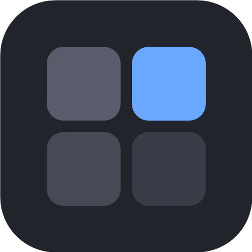
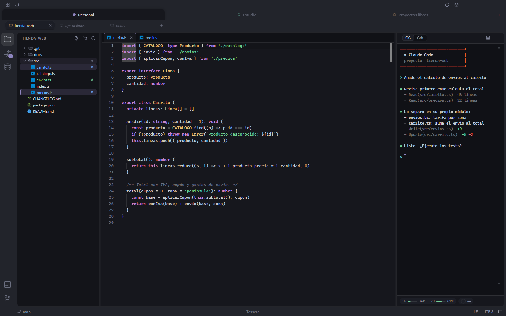
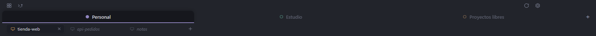
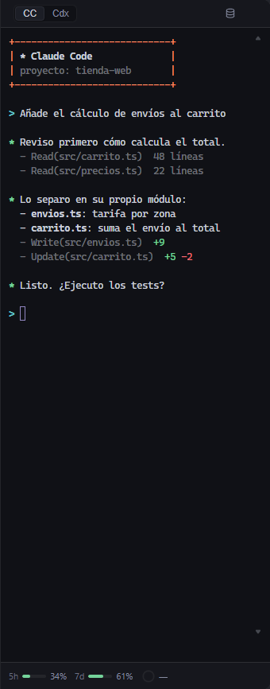
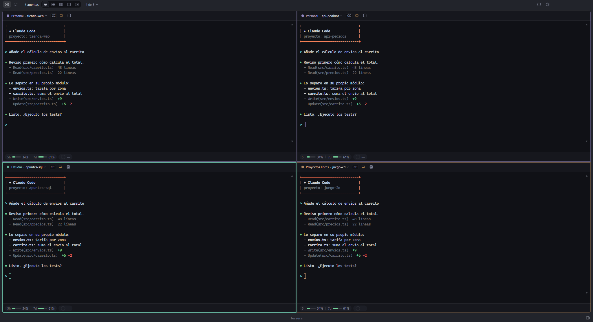
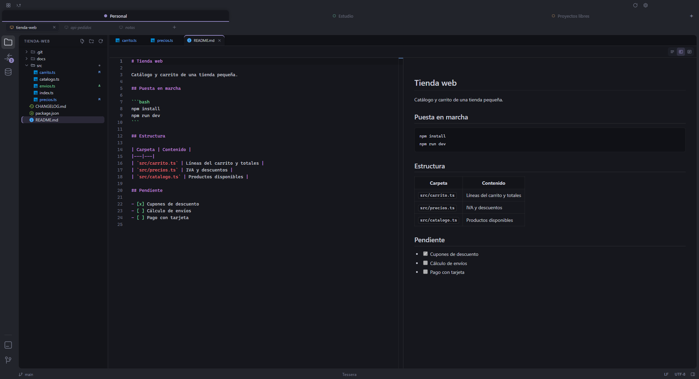
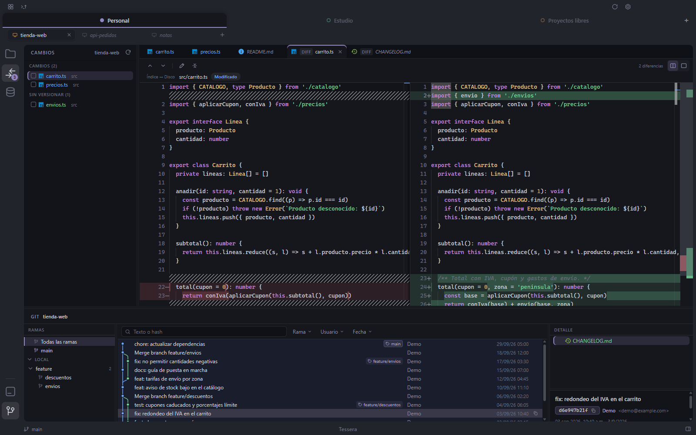
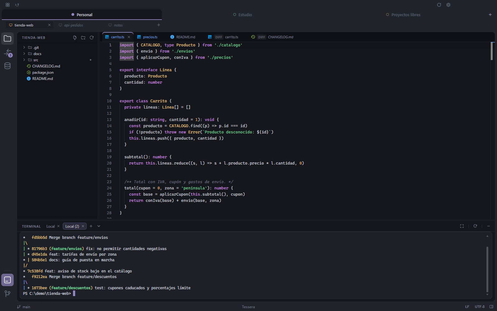
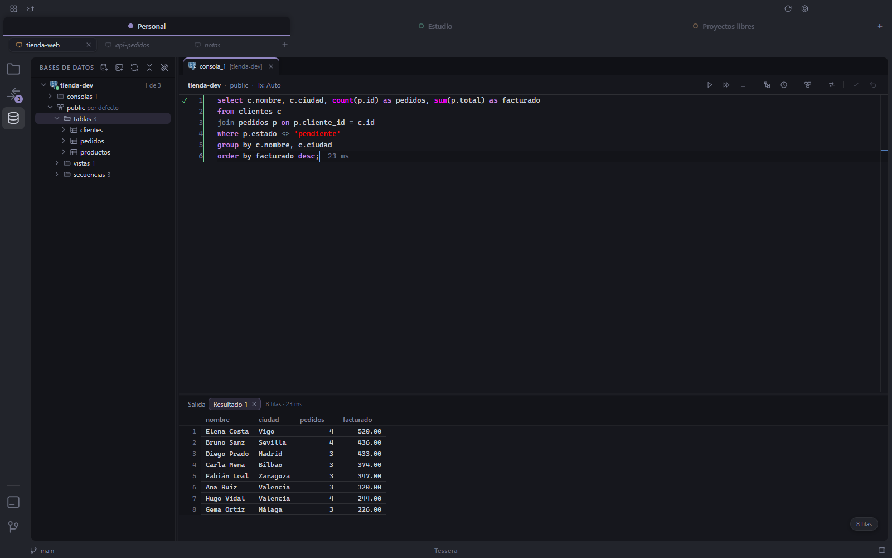
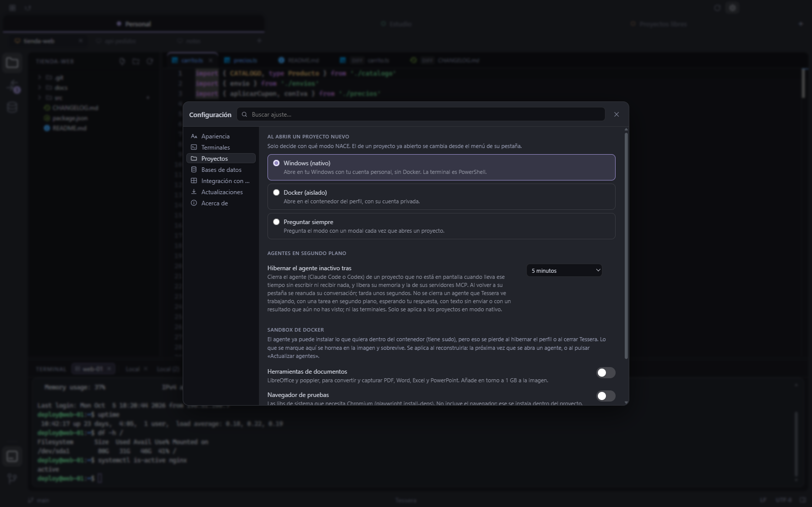

<p align="center">
  
</p>

<h1 align="center">Tessera</h1>

<p align="center">
  <strong>The desktop IDE for people who work across several projects and several AI accounts.</strong>
</p>

<p align="center">
  <a href="https://github.com/NRVH/tessera/releases/latest"></a>
  <a href="./LICENSE"></a>
  
</p>

<p align="center">
  <a href="./README.md">Leer en español</a>
</p>



AI coding agents are powerful, and they are also a new kind of process running on your
computer with your permissions. Tessera organizes your projects into **workspaces**, runs
Claude Code and Codex next to them, and lets you decide project by project how far an agent
can reach: natively, with the account on your computer, or inside the workspace's own Docker
sandbox, with an account that belongs to that workspace and only its projects in view.

> **Language note.** Tessera's interface and the project (its documents, issue templates and
> release notes) are in Spanish. This README, the contributing guide, the security policy and
> the code of conduct also have English versions, and issues and pull requests are welcome in
> English.

## Contents

- [Why Tessera](#why-tessera)
- [Download](#download)
- [Requirements](#requirements)
- [Getting started](#getting-started)
- [Features](#features)
- [Keyboard shortcuts](#keyboard-shortcuts)
- [Where your data lives](#where-your-data-lives)
- [Privacy](#privacy)
- [Building from source](#building-from-source)
- [Architecture](#architecture)
- [Tests](#tests)
- [Contributing](#contributing)
- [License](#license)
- [Author](#author)

## Why Tessera

- **Several AI accounts, each where it belongs.** Each project runs in one of two modes, and
  the mode decides the account. **Native** projects (the default) use the Claude Code and
  Codex account already signed in on your computer, the same one in every workspace.
  **Docker** projects use an account that belongs to their workspace: you sign in once inside
  that workspace, it is stored with it, and it is never shared with any other workspace. Put
  your personal plan, your team's plan or an account tied to one project in its own
  workspace, switch those projects to Docker, and each keeps its own conversation history and
  usage limits, without signing out every time you switch.
- **Agents see only what you give them, in Docker mode.** A Docker project's agent runs
  inside its workspace's container, with that workspace's projects mounted and nothing else:
  not your home folder, not your other repositories, not the rest of your disk. A wrong
  command or a malicious prompt stays inside the box. A native agent runs as you, with your
  permissions, like any agent you start from a terminal.
- **You stay in control.** New projects open natively unless you change the default in
  Settings, and any project can be switched between native and Docker from its tab. Agent
  credentials are mounted only while the agent runs. Database access goes through a small
  CLI that never shows the agent a password, and a connection can be made read-only for
  agents.
- **One window for all of it.** Editor, file explorer, Git, terminals and database
  connections next to the agents, with a tab per workspace and a sub-tab per project.

## Download

| Platform | Direct download (latest version) | Supported systems |
| --- | --- | --- |
| Windows | **[Download for Windows](https://github.com/NRVH/tessera/releases/latest/download/Tessera-Setup.exe)** (`.exe`) | Windows 11 (64-bit) |
| macOS | **[Download for Mac](https://github.com/NRVH/tessera/releases/latest/download/Tessera-mac-arm64.dmg)** (`.dmg`) | macOS 12 Monterey or later, **Apple Silicon only** (M1 and newer) |

Release notes and earlier installers are on
**[Releases](https://github.com/NRVH/tessera/releases)**.

The Windows installer is per user (no administrator rights needed) and lets you choose the
installation folder. On macOS, open the `.dmg` and drag Tessera to **Applications**.

Tessera updates itself on both platforms: a new version downloads in the background and is
applied when you close the app (you can change that in **Settings › Actualizaciones**).

### First launch of an unsigned app

Tessera is an independent open source project and is not signed with a paid code-signing
certificate, so both systems will warn you the first time you open it. This is expected.

- **Windows.** SmartScreen shows "Windows protected your PC". Click **More info** and then
  **Run anyway**.
- **macOS 15 Sequoia and later.** The first open is blocked. Go to **System Settings ›
  Privacy & Security**, scroll down and click **Open Anyway** next to the message about
  Tessera, then confirm.
- **macOS 12 to 14.** Right-click (or Control-click) Tessera in Applications, choose
  **Open**, and confirm.
- **Any macOS version, from the terminal:**

  ```bash
  xattr -dr com.apple.quarantine /Applications/Tessera.app
  ```

You only have to do this once: automatic updates are downloaded by Tessera itself and do
not trigger the warning again. If you would rather not trust a prebuilt binary, you can
[build Tessera from source](#building-from-source).

On macOS the app carries an ad-hoc signature, which changes with every build. Because of
that, macOS may ask again for permission to access folders such as Documents or Desktop
after an update.

## Requirements

| What | When you need it |
| --- | --- |
| **Docker Desktop** | Only for sandbox mode. On Windows, with the WSL 2 backend. Tessera builds its sandbox image the first time a workspace needs it. |
| **Claude Code** and/or **Codex** | Only for native mode: installed on your computer and signed in. In sandbox mode both come preinstalled in the image. |
| **Git** | For the Git view, which runs on your computer. On macOS it comes with the Xcode Command Line Tools. |
| **Java** (optional) | To decompile `.class` files. Tessera ships two engines: CFR, which runs on Java 6 or later, and Vineflower, which needs Java 17 or later. It finds every Java runtime installed and uses the best one for each engine. |

Linux is not supported yet.

## Getting started

1. **Open Tessera.** A fresh installation starts with one workspace called **Personal**.
   Workspaces are called *perfiles* in the interface.
2. **Create more workspaces** with the **+** at the end of the workspace bar: give each one
   a name and a color. Right-click a workspace to rename it, change its color, hibernate it
   or delete it, and drag it to reorder.
3. **Add projects** with the **+** in the project bar ("Abrir proyecto") and pick a folder.
   A project can be a single repository or a folder that contains several.
4. **Choose where the project runs.** New projects open in the mode set in
   **Settings › Proyectos › Modo por defecto** (native unless you change it): native (on
   your computer, with the account signed in on it, shared by every workspace), Docker
   (isolated, with the workspace's own account) or ask every time. Right-click a project
   tab to switch it between the two.
5. **Sign in to the agent.** In Docker mode, the agent panel offers **Iniciar sesión** the
   first time: that account is then used by every Docker project of the workspace. In native
   mode, the agent uses the account you are already signed in with on your computer.

## Features

### Workspaces and tabs



- Two levels of tabs: workspaces on top, each with its own color so you always know which
  account you are in, and the open projects of that workspace below.
- Reorder workspaces and projects by dragging them.
- Tessera remembers which projects each workspace had open and restores them when you
  reopen the app, without starting every agent at once: an agent starts when you enter its
  project.
- **Hibernate a workspace** to stop its container and free its memory; it wakes up where you
  left it when you go back to it.
- **Idle agents hibernate on their own**: a native agent of a project that is not on screen
  is closed after some minutes without activity (5 by default, or never) and resumes its
  conversation when you come back. It never happens while the agent is working, waiting for
  you or holding unsent text.
- Each workspace's container uses an isolated network by default, or the host network
  (when it is enabled in Docker Desktop) so that the servers an agent starts are reachable
  from your browser.

### Claude Code and Codex



- Both agents are available in every workspace, side by side, in a real terminal.
- Accounts follow the project's mode. Native projects share the account signed in on your
  computer. Docker projects use their workspace's own account, one per workspace and agent,
  kept in its own folder and never shared with another workspace. If you want isolated
  accounts, switch the project to Docker.
- **Conversation history** per project: browse past conversations, resume any of them or
  delete them. Opening a project resumes its last conversation.
- **Account usage** in the agent's footer (the 5-hour and weekly limits), and how much of
  the **context window** the current conversation is using.
- **Keep agents up to date.** In native mode, one button checks for new Claude Code and
  Codex versions, installs them and restarts only the sessions that need it, each one back
  in its conversation; it waits while an affected agent is still working. In Docker mode,
  "Actualizar agentes" rebuilds the sandbox image with the latest versions.
- Paste images and files into the agent's terminal; in Docker mode they are copied inside
  the container instead of passing a path the agent could not open.

### Sandbox or native, per project

- **Docker sandbox (isolated).** One container per workspace, created and managed by
  Tessera. Projects are mounted under `/workspace/<folder>`; nothing else from your disk is
  mounted except the agent's credentials and, read-only, your SSH keys, so Git over SSH keeps
  working with your own host aliases. The agent has `sudo` inside its container to install
  tools, without any extra Docker privileges. In **Settings › Proyectos** you can bake
  document tools, the system libraries a test browser needs, or any other Debian packages
  into the image.
- **Native (the default).** The agent and the terminal run on your computer, with your own
  account and your own tools: a desktop app started from local scripts, a database only
  reachable through your VPN. It needs no Docker, and the agent has the same access you
  have. Change the default in **Settings › Proyectos › Modo por defecto**, or switch a single
  project from its tab.

### Agent mosaic



Every agent that is working, in one grid of up to six tiles, so you can follow several
projects at once. Jump to a tile, maximize it, and leave the mosaic with the same shortcut
you used to enter it.

### Editor and viewers



- **Monaco** editor with syntax highlighting for many languages, find and replace, and
  tabs per project.
- Detects each file's **encoding and line endings**, shows them in the status bar and lets
  you convert them.
- **Markdown** with a rendered view (including Mermaid diagrams), a code view, or both side
  by side with synchronized scrolling. HTML files get an isolated preview.
- **Viewers** for PDF, Word (`.docx`), ZIP archives and images (with zoom).
- **Java archives**: `.jar`, `.war`, `.ear` and `.aar` open in the explorer like folders, and
  `.class` files are decompiled on the fly. Comparing two versions of an archive shows which
  entries changed and the diff of the decompiled classes.

### File explorer

- Multi-select with Ctrl/⌘-click and Shift-click, drag and drop to move, create, rename and
  delete.
- Copy and paste files between Tessera and Explorer or Finder through the system clipboard.
- **Search in files** across the whole project or one folder, with a live preview.
- Git status colors on files and folders, refreshed as files change on disk.
- **"Open with Tessera"** from the right-click menu of Windows Explorer (folders, any file,
  or associated extensions, each switchable in Settings) and, on macOS, a Finder quick action
  for folders plus "Open With" for code and text files. Tessera never makes itself the
  default app for a file type.

### Git



- **Changes**: the working tree as a list or a tree, stage and unstage, discard, ignore
  (in `.gitignore` or only locally) and commit.
- **History** with its branch graph, filters, commit details and the history of a single
  file.
- **Editable diffs**: fix something directly in the diff of your working copy.
- **Several repositories** in one project folder: pick which one the history shows.

### Terminals



- A terminal panel at the bottom of the window for the active project, with several
  terminals in tabs: inside the workspace's container in Docker mode, or your own shell in
  native mode (PowerShell on Windows, your login shell on macOS).
- Find in the scrollback, copy and paste that behave like the platform expects, and
  GPU-accelerated rendering that you can turn off in Settings.

### Databases



- **Oracle, PostgreSQL, SQL Server, MongoDB, Redis and SQLite**, in a **Connections** view
  of their own, organized per workspace.
- A tree of schemas and objects, a result grid with paging and export, SQL consoles with
  autocomplete, formatting, explain plans and query history, and consoles for MongoDB and
  Redis in their own syntax.
- **Editing with confirmation**: changes in the grid or in a console wait until you send
  them, all or nothing. Connections can be marked as development, testing or production,
  and production asks before writing. Tessera warns; it never locks you out.
- **Read-only is for agents.** Marking a connection read-only limits what agents can do with
  it; it never limits you.
- **`tdb` for agents.** Attach a connection to a project and the agent can query it with a
  small CLI, `tdb`, by the connection's name. The agent never sees the password.
- Oracle works out of the box in thin mode. Older servers that need thick mode use Oracle
  Instant Client, which Tessera can download for you from oracle.com, or you can point it
  to one you already have.
- Passwords are encrypted with your system's secret store (DPAPI on Windows, the Keychain
  on macOS).

### Settings



A searchable settings window (Ctrl+, / ⌘,): appearance and zoom, terminal fonts, the
default project mode and agent hibernation, the sandbox image, database defaults, system
integration, updates, and an About page.

### Automatic updates

Tessera checks its release feed on GitHub, downloads new versions in the background and
applies them when you close the app, on Windows and on macOS.

## Keyboard shortcuts

The main modifier is Ctrl on Windows and ⌘ on macOS. A few gestures use a different key
on each platform, following each system's conventions.

| Action | Windows | macOS |
| --- | --- | --- |
| Settings | Ctrl+, | ⌘, |
| Search in files | Ctrl+Shift+F | ⇧⌘F |
| New file (new console in Connections) | Ctrl+N | ⌘N |
| Show or hide the terminal panel | Ctrl+` | ⌃` |
| Zoom in / out / reset | Ctrl+= / Ctrl+- / Ctrl+0 | ⌘= / ⌘- / ⌘0 |
| Enter or leave the agent mosaic | Ctrl+Shift+M | ⇧⌘M |
| Focus mosaic tile 1 to 6 | Ctrl+1 … Ctrl+6 | ⌘1 … ⌘6 |
| Maximize or restore the focused tile | Ctrl+Shift+Enter | ⇧⌘↩ |
| Find in a terminal | Ctrl+F | ⌘F |
| Copy in a terminal (with a selection) | Ctrl+C | ⌘C |
| Paste in a terminal | Ctrl+V | ⌘V |
| Open the selected item (explorer, database tree) | F4 or Enter | F4, ⌘↓ or Enter |
| Delete the selected files | Delete | ⌘⌫ or Delete |

In the **Connections** view:

| Action | Windows | macOS |
| --- | --- | --- |
| Run the current statement | Ctrl+Enter | ⌘↩ |
| Run the whole console | Alt+X or Ctrl+Shift+Enter | ⌥X or ⇧⌘↩ |
| Stop | Ctrl+F2 | ⌘. |
| Commit | Ctrl+Alt+Shift+K | ⌥⇧⌘K |
| Rollback | Ctrl+Alt+Shift+R | ⌥⇧⌘R |
| Explain plan | Ctrl+Shift+E | ⇧⌘E |
| Query history | Ctrl+Shift+H | ⇧⌘H |
| Format SQL | Ctrl+Alt+L | ⌥⌘L |
| Close the tab | Ctrl+W | ⌘W |
| Show or hide the agent | Ctrl+Alt+B | ⌥⌘B |

## Where your data lives

| Platform | Folder |
| --- | --- |
| Windows | `%APPDATA%\Tessera` |
| macOS | `~/Library/Application Support/Tessera` |

That folder holds your workspaces, the open tabs, settings, the agent sign-ins used in
sandbox mode, database connections (with encrypted passwords), saved consoles, Oracle
Instant Client if you downloaded it, and logs. Writes are crash-safe, with a backup copy of each file.

**Your projects are never copied.** Tessera opens them where they are; in sandbox mode it
mounts the project folders into the workspace's container. The Windows uninstaller asks
whether to keep or delete your data, and an update never touches it.

## Privacy

- **What an agent sees.** In sandbox mode, only the projects of its workspace, its own
  credentials and, read-only, your SSH keys. In native mode, an agent runs as you on your
  computer, like it would in any terminal.
- **No telemetry.** Tessera has no analytics, no crash reporting service and no usage
  tracking. Logs are written only to the data folder above.
- **Network connections Tessera makes by itself:**
  - the update feed on GitHub (`github.com/NRVH/tessera/releases`);
  - the account usage shown in the agent's footer, read from Anthropic's API with that
    account's own token (for Codex it is read from local files);
  - checks for new agent versions against the npm registry, the Claude Code release feed
    and, on macOS, Homebrew;
  - when you ask for it, the Oracle Instant Client download from oracle.com;
  - when it builds the sandbox image, Docker pulls the base image and packages from their
    public registries.
- **What each agent does with its provider** (Anthropic for Claude Code, OpenAI for Codex)
  is governed by that provider and your account, not by Tessera.
- **Database passwords** are stored encrypted with the system's secret store, and agents
  reach the databases through `tdb` without receiving them.

## Building from source

You need **Node.js 22.18 or later** (the release workflow uses the latest Node 22) and
**Git**. For sandbox mode you also need Docker Desktop.

```bash
git clone https://github.com/NRVH/tessera.git
cd tessera
npm ci
npm run dev
```

`npm run dev` downloads the Electron binary on first run and opens the app with hot reload.
The development instance keeps its data in a separate `Tessera-dev` folder, so it never
touches an installed copy.

To build an installer for your own platform:

```bash
npm run release:win   # Windows: dist/Tessera-<version>-Setup.exe
npm run release:mac   # macOS:   dist/Tessera-<version>-arm64.dmg (and the .zip used by updates)
```

electron-builder does not cross-compile, so each platform is built on that platform. On
macOS the app is signed ad hoc automatically: you do not need an Apple developer account.

| Command | What it does |
| --- | --- |
| `npm run dev` | Run the app in development mode with hot reload |
| `npm run build` | Type-check and compile into `out/` |
| `npm run pack:dir` / `npm run pack:mac:dir` | Package without an installer (`dist/win-unpacked`, `dist/mac-arm64`) |
| `npm run release:win` / `npm run release:mac` | Build the installer for the current platform, without publishing |
| `npm run typecheck` | Type-check the main process, the interface and the e2e suite |
| `npm run lint` | ESLint over the whole repository |
| `npm run test:<name>` | Run one test script (see `package.json`) |
| `npm run test:e2e` | Run the Playwright suite against the packaged app |

## Architecture

```
            ┌──────────── Tessera (host) ────────────┐
            │  editor · explorer · Git · settings    │
            └───────┬───────────────┬────────────────┘
                    │ IPC           │ IPC
          ┌─────────▼──────┐  ┌─────▼──────────┐
          │ workspace A    │  │ workspace B    │   one container each
          │ /workspace/…   │  │ /workspace/…   │   only its own projects
          │ /agent-config  │  │ /agent-config  │   its own account, mounted
          │ claude · codex │  │ claude · codex │   only while the agent runs
          └────────────────┘  └────────────────┘
```

- Electron, TypeScript and React, with electron-vite. Monaco for the editor, xterm.js and
  node-pty for the terminals, the system's `git` binary for Git, and Docker for the sandbox.
- The editor, the explorer and Git run on your computer (they are your tools); the agents
  and their terminals run in the workspace's container, unless the project is native.
- The interface runs with `contextIsolation` and `sandbox` enabled and talks to the main
  process only through typed IPC. Two rules cross all of it:
  - **The interface never sees or sends host paths.** Everything travels as paths relative
    to the project folder, and the main process translates them.
  - **Every IPC channel is declared** in `src/shared/*-ipc.ts`, with its request and
    response types, and exposed through `src/preload/`.
- The sandbox image is built from [`docker/sandbox/`](./docker/sandbox/).

```
src/
  main/       Electron main process: sandbox, agents, Git, files, databases, updates
  preload/    the typed bridge exposed to the interface
  renderer/   React interface, organized by feature
  shared/     IPC contracts and pure logic used by both sides
  tdb/        the database CLI that agents use
docker/       the sandbox image
e2e/          Playwright suite against the packaged app
```

The code standard is in [`docs/ESTANDAR_CODIGO.md`](./docs/ESTANDAR_CODIGO.md) and the
design decisions are recorded in [`docs/decisiones/`](./docs/decisiones/README.md) (both
in Spanish).

## Tests

```bash
npm run typecheck
npm run lint
npm run test:<name>                   # one test script
node scripts/pruebas/bateria.mjs git  # every test:* whose name matches a regex, one after another
npm run test:e2e                      # Playwright against the PACKAGED app
```

- Unit tests are `test-*.mts` files next to the module they test, run with plain `node`
  (native type stripping). There is no test framework and no aggregate `npm test`; each one
  has its own `test:<name>` script, and about thirty of them need Docker running.
- `test:cabeceras`, `test:comentarios` and `test:menciones` check the code standard.
- The end-to-end suite drives the packaged app (`dist/win-unpacked` or
  `dist/mac-arm64/Tessera.app`), so rebuild it with `npm run pack:dir` or
  `npm run pack:mac:dir` after changing application code.

## Contributing

Issues and pull requests are welcome, in English or in Spanish. Please read
[CONTRIBUTING.en.md](./CONTRIBUTING.en.md) first: the code is written in Spanish, and Windows
and macOS are both first-class platforms. Report vulnerabilities privately as described in
[SECURITY.en.md](./SECURITY.en.md). Everyone taking part is expected to follow the
[Code of Conduct](./CODE_OF_CONDUCT.en.md).

## License

[MIT](./LICENSE) © 2026 Noé Roberto Vázquez Herrera.

Tessera includes third-party software under its own licenses; see
[THIRD_PARTY_NOTICES.md](./THIRD_PARTY_NOTICES.md).

## Author

Made by **Noé Roberto Vázquez Herrera** · [GitHub](https://github.com/NRVH) ·
[LinkedIn](https://www.linkedin.com/in/noe-vazquez-03863423a/)

If Tessera is useful to you and you want to support its development, you can do so through
**[PayPal](https://paypal.me/NoeRvH)**. Thank you!
